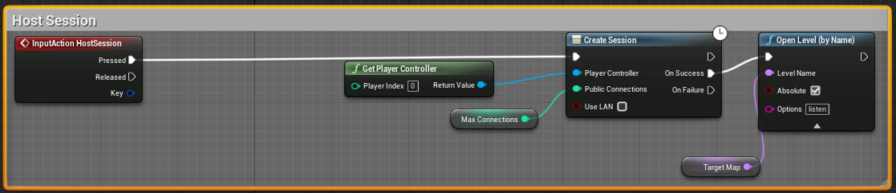
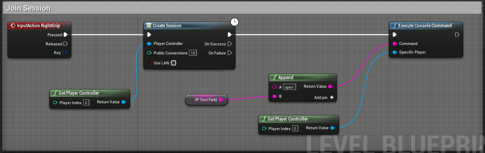
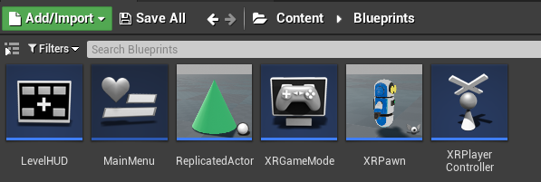
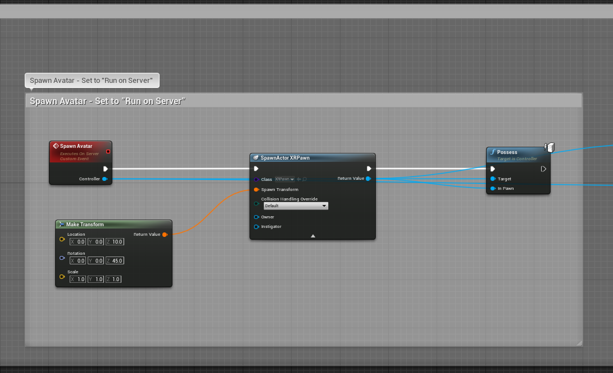
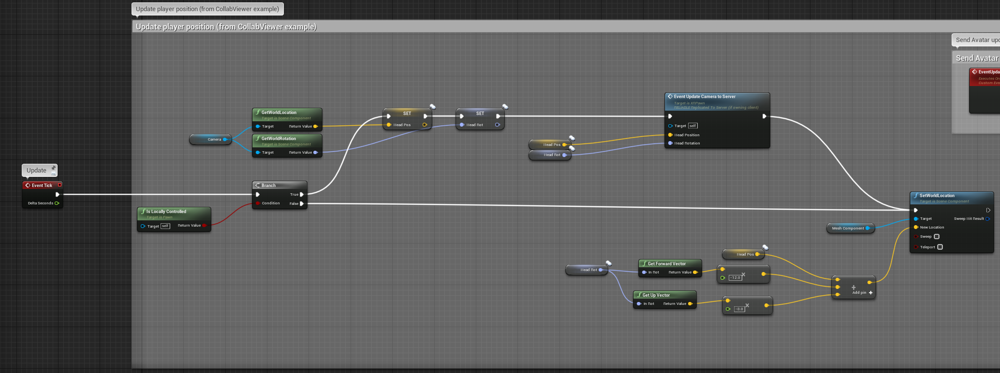
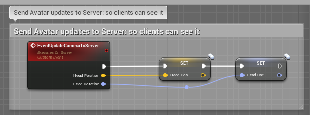

# HL2Collab
## _Multiplayer Networking on the HoloLens_
---
# Instructions

- Open the *Level* blueprint in MainMenuMap. This contains instructions as well.
- Set the **IP_TextField** variable to your computer's IP Adress
- Create a Desktop Build. This will be the host
- Create HL2 or more Desktop builds to act as clients
- Run the Desktop version, and press "H" to begin hosting the map.
- Run the HL2 clients, and "right pinch" to join the session to the host on the IP Address provided earlier
- (Optional) Run any other Desktop executables, and press "J" to join

## Explanation of Code

There are two Maps: *MainMenuMap* and *MainMap*

- **MainMenuMap:** Takes care of creating sessions. It has the host and client logic, and creates a Menu that displays some information when connecting. The menu doesnt do much. Its meant as a starting point for you to extend.  Important variables in the level blueprint: 
 
    *  **TargetMap**: A string that contains the name of the map the host will load, and clients will connect to.
    *  **IP_TextField**: The IP Address of the host. Its hard-coded for simplicity, but ideally you will want to provide a way for changing this, or discovering it, at runtime.

    There are two important functions that the *MainMenuMap* performs:
    - **Host:** The Host creates a session, and then immediately opens the map/level that it wants all clients to connect to. Since the host is also a player (rather than a dedicated server), we set it to be a *listen* server under the "Open Level" options. Note that the LevelName is passed as a variable string defined in the Level Blueprint . 
 
    - **Join:** Joining is very similar to hosting. The primary difference is that once a session is created, instead of opening a Map/Level by name, we pass the "Open" command an IP address. We used a simple "Execute Console Command" node to do this.
 

- **MainMap:** This is the Map that clients will connect to. Its main function (other than dsiplaying the level geometry) is to spawn the XRGameMode. This map will make use of the important Blueprint Assets in the Blueprints folder: 

    - **XRGameMode:** Spawns a XRPlayerController and a HUD.Note that it does *not* spawn a Pawn. This is because there will be multiple pawns, one for each client, and we want to ensure that there is logic so that each controller is able to control only its own Pawn. 

    - **XRPlayerController:** Every player will have a single player controller. The XRPlayerController takes care of spawning the avatar for its own client. Since multiple controllers may be replicated to a machine from the server, we need to make sure we are using the "local" player controller, i.e, the one that owns this client. 

    Once we have the correct controller, we can proceed to call the spawning code on the server. The server then replicates this to every client. 

    Note that SpawnAvatar is a custom event, and it is set to "RunOnServer".

    - **XRPawn:** The Pawn/Avatar updates and stores its position and rotation in HeadPos and HeadRot variables every tick.

        They are set to "replicate" so that when XRPawn sends this data to the server (again, via a custom event), the server replicates it to all the clients.

