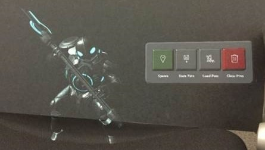
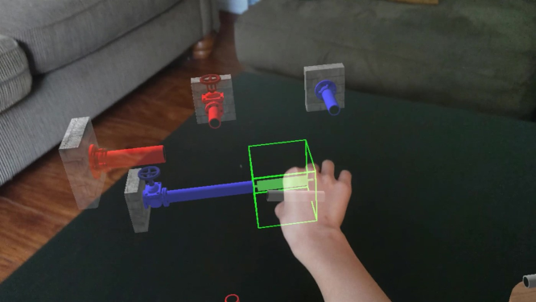

# Unreal Samples

This repository hosts and links to sample applications for mixed reality projects built with Unreal Engine. For more information about mixed reality development in Unreal, check out the [documentation](https://docs.microsoft.com/en-us/windows/mixed-reality/unreal-development-overview).

| [HoloLens 2 Example](https://github.com/microsoft/MixedReality-Unreal-Samples/tree/master/HoloLens2Example) Built with: UE 4.26  | [Chess App](https://github.com/microsoft/MixedReality-Unreal-Samples/tree/master/ChessApp) Built with: UE 4.26, UXT 0.9     |
| :---------------- | :----------- |
| **About:** Spawn Paragon minions on the surface of your world and store their locations with persistent anchors  **Key Features:** Fingertip cursor \| Pushable buttons \| Spatial mapping and collision understanding \| Launching, saving and loading persistent anchors in the world | **About:** The final result of the Unreal + UX Tools [tutorial](https://docs.microsoft.com/en-us/windows/mixed-reality/unreal-uxt-ch1) located on the Microsoft Mixed Reality docs, consisting of a chess board, a chess piece, and a reset board button  **Key Features:** [UX Tools](https://aka.ms/uxt-unreal) plugin integration: direct + far manipulation, buttons |
| **[HoloPipes](https://github.com/microsoft/MixedReality-Unreal-HoloPipes) Built with: UE 4.26**  | **[Kippy's Escape](https://github.com/microsoft/MixedReality-Unreal-KippysEscape) Built with: UE 4.26, UXT 0.9**  |
| **About:** Play the classic pipes puzzle game, taken to another dimension! Connect all pipe starts to their ends to finish the level. **Key Features:** Direct manipulation \| Buttons \| Voice commands \| Eye tracking \| Hand menu \| Scrollable list \| Export progress to OneDrive \| Tutorials \| Accessibility features | **About:** A fun puzzle game highlighting basic HoloLens 2 interactions: solve puzzles to help Kippy the robot reach its rocket ship and escape!  **Key Features:** [UX Tools](https://aka.ms/uxt-unreal) plugin integration: hand interaction actors, bounds controls, manipulators, sliders, buttons \| Spatial audio \| Eye tracking |

## How to build and deploy sample apps

Make sure you have the proper version of Unreal Engine installed on your computer. 
* If you do not have a HoloLens 2 device, first follow the [App Packaging Instructions](https://docs.unrealengine.com/en-US/Platforms/AR/HoloLens2/HowTo/PackageApp/index.html) and then follow the [Emulator Quickstart Instructions](https://docs.unrealengine.com/en-US/Platforms/AR/HoloLens2/QuickStartEmulator/index.html) to deploy the app to the [HoloLens 2 Emulator](https://docs.microsoft.com/en-us/windows/mixed-reality/using-the-hololens-emulator)
* If you have a HoloLens 2 device and want to run the app on device, first follow the [App Packaging Instructions](https://docs.unrealengine.com/en-US/Platforms/AR/HoloLens2/HowTo/PackageApp/index.html) and then follow the [Device Quickstart Instructions](https://docs.unrealengine.com/en-US/Platforms/AR/HoloLens2/QuickStartDevice/index.html) to deploy the app to your HoloLens 2
* If you have a HoloLens 2 device and want to stream the app from your PC to the device, follow the [Streaming Quickstart Instructions](https://docs.unrealengine.com/en-US/Platforms/AR/HoloLens2/QuickStartStreaming/index.html) to stream the app from the Unreal editor to your HoloLens 2

## Contributing

This project welcomes contributions and suggestions.  Most contributions require you to agree to a Contributor License Agreement (CLA) declaring that you have the right to, and actually do, grant us the rights to use your contribution. For details, visit https://cla.microsoft.com.

When you submit a pull request, a CLA-bot will automatically determine whether you need to provide a CLA and decorate the PR appropriately (e.g., label, comment). Simply follow the instructions provided by the bot. You will only need to do this once across all repos using our CLA.

This project has adopted the [Microsoft Open Source Code of Conduct](https://opensource.microsoft.com/codeofconduct/). For more information see the [Code of Conduct FAQ](https://opensource.microsoft.com/codeofconduct/faq/) or contact [opencode@microsoft.com](mailto:opencode@microsoft.com) with any additional questions or comments.